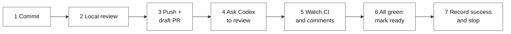
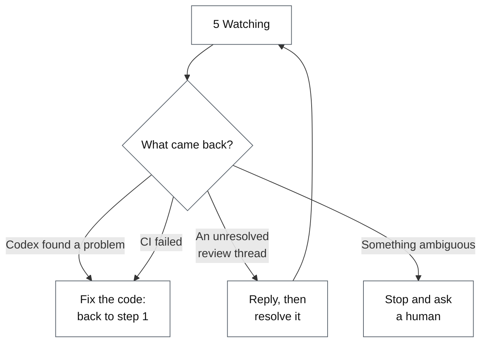
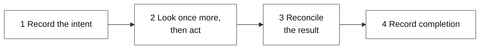

# How Review Bridge reviews a change

This is the narrative introduction: what happens to one change from commit to
merge-ready, and why each step exists. For installation and the complete tool
reference, see the [README](../README.md).

## The problem it solves

AI-written code needs review before it merges. But "it was reviewed" is easy
to fake, usually by accident:

- the code keeps changing while the review happens, so the verdict describes
  something other than what ships;
- the model that wrote the code reviews its own work and finds it fine;
- a reviewer says "CI was green" without having looked, or having looked at a
  state that is minutes stale.

Review Bridge's answer: **every step leaves evidence a machine can check.**
Who reviewed, exactly which bytes they reviewed, what CI said at the time —
all of it is recorded, and later steps refuse to proceed when the record does
not hold up.

---

## When everything goes well

A change driven by the autonomous workflow moves through seven steps. Two
words used throughout: the **driver** is the model (or person) calling the
tools, and the **ledger** is the server-side record the tools write — the
driver proposes, the ledger decides what counts. (Every step can also be
performed manually through the same tools; the workflow adds ordering,
ownership, and crash recovery on top. The manual path differs in a few places
noted below.)

**1 — Commit.** The working tree must be clean, and each new head must
descend from the previous one. No force-pushes, no rewrites.

**2 — Local review.** The first gate, before the code leaves your machine.
The system captures an **immutable snapshot** of the change and hands it to a
reviewer that had no part in writing it. The reviewer reads the snapshot,
never your live working tree, and submits structured findings. No findings
means `CLEAN`.

The autonomous workflow always dispatches this review to a brand-new **Codex
task**, reconciled by a correlation marker. On the manual path you choose the
reviewer — a fresh Claude Desktop conversation, a new Codex task, or an
isolated Hermes or DeepSeek Harness profile — though a change headed for
publication takes the new Codex task by default, with any other provider read
as a second opinion beside that gate rather than in place of it. A manual
snapshot may also capture uncommitted working-tree state; the workflow never
has any, since step 1 required a clean tree.

Before dispatch, the immutable patch is measured as added plus deleted lines.
At 75% of the current budget, the driver reports the total and remaining
headroom and states whether it will continue or split; this warning does not
block. The autonomous workflow pauses for an operator decision when the total
exceeds its default 2000-line budget, so no reviewer context is spent before a
split is discussed. A manual review reports the same measurement but proceeds,
because the operator is already present.

Note that this gate attests **snapshot consistency**, not test results:
finalizing it re-checks that the tree still matches what the reviewer saw.
The deterministic test gate lives later, in step 5, where CI results are
provider evidence rather than the author's word.

**3 — Push and open a draft PR.** What gets pushed must be byte-for-byte the
head that passed review. The PR is created as a **draft**: draft means
reviewers are not looking at it yet, and the workflow relies on that.

**4 — Ask Codex to review.** The server composes the request comment — with a
correlation marker — and the driver posts it verbatim. The marker is how a
later result is recognized as answering *this* request rather than one from
last week. (This is the one external write that does not use the four-step
action trail described below: the comment is posted, then bound to the ledger,
and a crash between the two is caught by unbound-request detection — the
marker makes the orphan recognizable.)

**5 — Watch.** Periodically the driver collects the PR's complete state in
one pass — check runs, Codex results, review threads — and records it in the
ledger. The ledger derives a status from each observation.

**6 — Mark ready.** Only when the local gate passed, Codex returned a clean
correlated result, every required check succeeded, and every thread that
should be resolved is resolved, may the PR leave draft. The clearance is read
again immediately before the call: a blocker that appeared in between refuses
the write. (On the manual path, this is simply you clicking "Ready for
review" — the marking step belongs to the autonomous workflow.)

**7 — Record success and stop.** One more observation confirms nothing moved,
the resolution records are replayed against that same observation, and the
workflow writes a terminal `MERGE_READY` record — then **stops**. It does not
merge. Merging takes a separate, explicit operator instruction through the
publication gate.

---

## When things do not go well

Step 5 rarely passes on the first try. The common cases:

**Fixing code restarts the pipeline.** A new commit is a new head, and a new
head repeats local review from the top. Previous verdicts do not carry over —
deliberately. A repair phase can only be left by recording that new head:
even a check that goes green on a bare re-run leaves the workflow waiting for
a real fix or an operator decision.

**Threads are answered before they are closed.** The workflow never silently
resolves a Codex comment thread. It posts a reply naming the commits that
addressed the finding, waits until that reply shows up in a recorded
observation, and only then resolves — so the thread's history shows who
closed it and on what grounds. Threads it cannot prove it owns stay open for
a human.

**Ambiguity stops the run.** An uncorrelated Codex result, a merge conflict,
a PR someone closed — the workflow pauses with the exact evidence and waits.
It does not guess.

---

## One rule that runs through everything

Once a draft PR becomes ready, **no new commits are pushed to it** — at that
point reviewers may be reading it, and swapping the code out from under a
review is the exact failure this tool exists to prevent.

So when a ready PR needs another change, the workflow first returns it to
**draft**, then repairs. The rule is enforced at three separate points: when a
repair would start, when a new head would be recorded, and in the pre-push
read itself.

---

## The autonomous workflow: every external action leaves a trail

The workflow's driver is a model, and a model can crash at any point. Each
externally visible action — pushing, creating the PR, posting a thread reply,
resolving a thread, flipping draft state either way — therefore goes through
the same four durable steps (the Codex review request of step 4 is the one
exception, with its own recovery):

Why four steps instead of just doing it? Because after a crash, the restarted
driver reads the ledger and knows exactly where it stopped. Stopped at 1:
nothing external happened, safe to retry or drop. Stopped at 2: the call may
or may not have landed — go reconcile against the provider instead of firing
again, which is what prevents duplicate comments and double pushes.

Step 2's "look once more" also catches the world moving between planning and
acting: if CI failed in the meantime, the action refuses rather than execute
a stale decision. And the reconciliation in step 3 decides its outcome from
that pre-action reading, not from what the driver claims: a driver whose
pre-read found the PR already ready cannot claim the ready flip as its own
work.

---

## Details worth knowing

**Why the snapshot matters so much.** A verdict has to bind to exact bytes.
The snapshot carries the full diff plus a byte-range index per file, so a
reviewer can read only what it cares about — but everyone reads the same
immutable thing, and the index is derived fresh from the stored patch on
every read rather than stored where it could drift.

**How round two works.** Local review is capped at two rounds: the reviewer
files findings, the author answers every one (`fixed`, `rejected`, or
`human_required`, each with a rationale), and the reviewer re-checks against a
new snapshot, dispatching each prior finding as resolved, rebuttal-accepted,
or still open. A prior finding that stays open escalates to a human. If all
prior findings are accepted but the reviewer finds a new issue, the author
addresses it and starts a fresh full review carrying only the bare finding as
a scope hint. There is no third round for the same review ID.

**Why some reads refuse to paginate.** Paginated reads do not describe one
moment. If page one says "checks green" and a check fails while you fetch
page two, the assembled "complete" picture is fiction. So the resources where
a single deciding value matters — check runs, commit statuses, review
threads — are read in one request each, and a response that indicates another
page **fails the collection** rather than walking it. The three comment and
review feeds are walked page by page, but each page's provenance is recorded
and the adapter validates the walk's completeness before anything is decided
from it.

**Templates are packaging, not the capability boundary.** The repository
ships install templates for a Codex plugin, a Claude Desktop reviewer
extension, and Hermes and DeepSeek Harness profiles. The author side is the same server started
with `--role author`, and any MCP client — Claude Code included — can drive
it; a small script importing the modules directly works too.

---

## What works today, and what is still open

Everything above is implemented and tested: local review with four isolated
reviewer providers, publication with baseline and atomic observations, the
thread reply-and-resolve loop, mark-ready, return-to-draft, and the terminal
record.

Still open: compensating unresolve (reopening a thread whose resolution was
later proven wrong — the capability is declared and the evidence chain is
validated, but the action is not yet implemented), end-to-end crash-recovery
tests, and final packaging. RFC 0003 flips from `Accepted` to `Implemented`
when those land.
